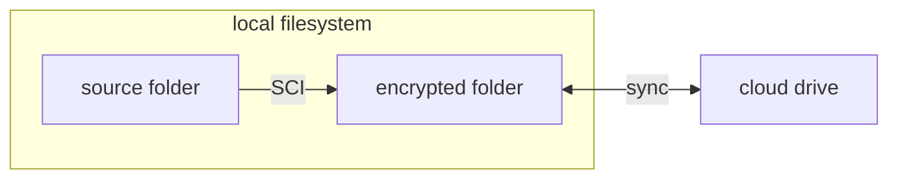
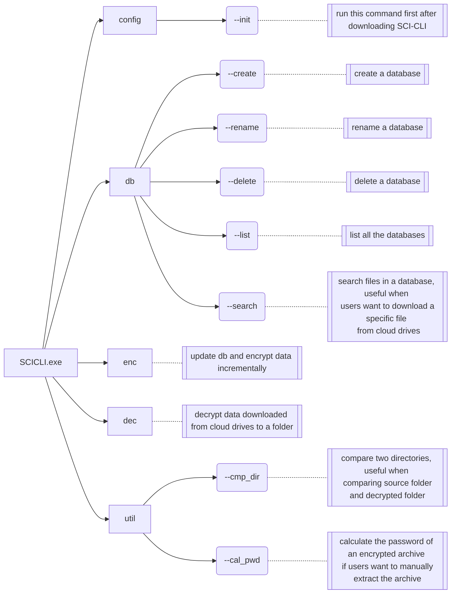

# SecureCloudInspector

<a href="https://github.com/gustaavv/SecureCloudInspector/releases">
  
</a>

<a href="https://github.com/gustaavv/SecureCloudInspector/commits/master/">
  
</a>

<a href="https://github.com/gustaavv/SecureCloudInspector/blob/master/LICENSE">
  
</a>

> call this tool **SCI** for short.

Encrypting your data before uploading to cloud drives should be a common practice. However, managing this process is often tedious. Therefore, **SecureCloudInspector** (**SCI**) comes to help you.

Unlike other encryption tools, SCI **focuses on both data security and data recoverability** when it comes to cloud storage.

# What SCI is

SCI is a command line tool that encrypt your data before uploading to cloud.

> planning to develop a GUI.

## General Introduction

SCI encrypts your data **at folder level**. Let's call the folder you want to encrypt as **source folder**. Then, choose an **encrypted folder**, where the encrypted data is located. Now, users can set the encrypted folder for sync by cloud drive clients. The encrypting process is fully managed by SCI.



The decryption process is alike. After you download the encrypted folder, SCI decrypts your data.

## Detailed Encryption Mechanism

<details>
<summary>Click me 👈</summary>

First, let's talk about existing encryption tools/practices first.

1. Veracrypt: strong (even absolute) data security, encrypting a filesystem into a single file. In terms of cloud storage, a large file needed to be uploaded every time we modify something in the encrypted filesystem, which is bad.
2. Cryptomator: strong data security, encryption is on file level (of a folder we want to encrypt), which is good for cloud storage scenario. But, the key file is stored in the encrypted folder. Nobody can guarantee that cloud drive provider keep the key file safe --- it can be broken. In such case, the whole encrypted data is broken.
3. Using archives: pack the data we want to encrypt into an archive with a password, and then upload it to cloud drive. It is a common practice, but involves manual work. Only this archive is broken if error in cloud drive happens, while other archives remain correct.

Second, let's talk about the data we want to encrypt:

- How often do we use them? Just for archiving or using it regularly?
- How secure should they be?
    - absolute secure against security agencies --- you are doing something evil. Do you really think a program is enough to "protect" you?
    - secure against cloud drive providers --- Justice is on our side. Those cloud drive providers will definitely use our data for advertisements and training AI without our grant.
    - secure against other users of the computer --- a common usecase.
    - Whatever --- nothing hurts if leaked. Why are you reading this document now?

---

Now, let's talk about SCI.

SCI's encryption is on file level, using an archive to encrypt each file. The folder structure is the same, while names of folders and files are Hexadecimal string (results from hash functions, e.g. sha256, sha1). An example:

Source folder:

```
.
└── film
    ├── documentary
    │   ├── film1.avi
    │   └── film2.avi
    └── action
        └── film3.avi
```

Encrypted folder:

```
.
└── d0607f7a
    ├── 3708de48
    │   ├── 79bb81ea.rar
    │   └── 7c62a2d7.rar
    └── bd938c68
        └── a2bea7e8.rar
```

> You may notice (really?🤨) the encrypted names are the first 4 bytes of the sha256 result of the filename. Don't worry.
> This is just an example. The real encrypted names are different.

In terms of data security, **the purpose of SCI is to be secure against cloud drive providers (nobody else)**. There is a password for each source folder, inputted by the user, say `pwd`. The real password for every archive is a function `pwd_func(md5(pwd), sha1(pwd), sha256(pwd), filename)` (filename is also hashed first). So, `pwd` can be short and easy to remember, while the archive's password is hard to brute-force attack.

In terms of data recoverability, SCI takes advantage of rar files' recovery record. Therefore, every archive itself is recoverable. In addition, users can manually extract the archives even if SCI no longer exists.

Lastly, the metadata of a source folder(`pwd`,folder structure, name of each file etc.) is stored **in plaintext**. This follows the purpose of SCI as long as the cloud drive providers do not get these data.

</details>

# What SCI is not

- A tool that follows every modern cryptography rule. Choose other tools that guarantee absolute data security if you prioritize it.
- A cloud drive client.

# How to use

## Prerequisite

1. SCI is currently based on WinRAR. **Install WinRAR before using this tool. If you do not like WinRAR, do not use this tool --- it simply cannot work.**
2. SCI currently only works on **Windows 10/11**.

## SCI-CLI command

SCI-CLI works in **interactive mode**. So, all the commands are listed below, nothing else.

In SCI-CLI, a database means all information of a source folder.



E.g.

```shell
SCICLI.exe db --list
```

# Name

"Secure Cloud Inspector" means an inspector between users' local filesystem and the cloud drive, aiming to secure privacy of users' data in the cloud drive transparently.

Finding a proper abbreviation is also the target (maybe the main target 🤣).

# Why C#?

I have a good knowledge of Python and Java before developing this project. But Python lacks performance and Java is hard to use when developing GUI;

C# have good performances and it is way better than Java in terms of developing a Windows program, developing a GUI program (it seems so) and coding experience;

Since C# resembles Java, it's a good opportunity for me to practice coding in C#.

