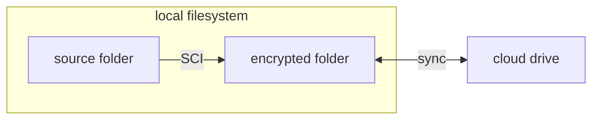
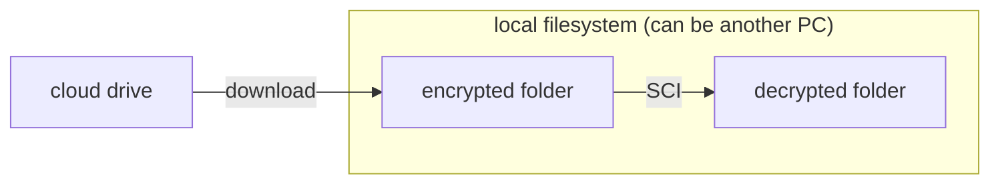

<h1>SecureCloudInspector</h1>

SCI is a tool to encrypt your data before uploading to cloud drives, focusing on both data security and data recoverability.

## Introduction

Encrypting your data before uploading to cloud drives should be a common practice. However, managing this process is often tedious. Therefore, **SecureCloudInspector** (**SCI**) comes to help you.

Unlike other encryption tools, SCI **focuses on both data security and data recoverability** when it comes to cloud storage.

SCI offers **both CLI (SCI-CLI) and GUI (SCI-Desktop)**.

## Brief Overview of Encryption

SCI encrypts your data **at folder level**. Let's call the folder you want to encrypt as **source folder**. Then, choose an **encrypted folder**, where the encrypted data is located. Now, users can set the encrypted folder for sync by cloud drive clients. The encrypting process is fully managed by SCI.

The decryption process is alike. After you download the encrypted folder, SCI decrypts your data.

## Quick Links

- [Getting Started](https://gustaavv.github.io/SecureCloudInspector/gettingStarted/prerequisite/)
- [SCI-CLI commands](https://gustaavv.github.io/SecureCloudInspector/userGuide/cli/)
- [Detailed Encryption Mechanism](https://gustaavv.github.io/SecureCloudInspector/architecture/encryptionMechanism/)
- [Developer Guide](https://gustaavv.github.io/SecureCloudInspector/developerGuide/roadmap/): Roadmap, how to contribute, etc.
- [Others](https://gustaavv.github.io/SecureCloudInspector/others/)