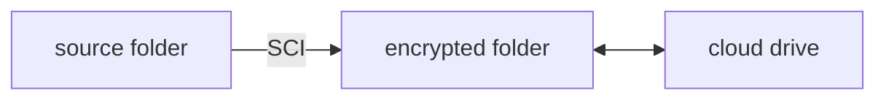

# SecureCloudInspector
> call this tool **SCI** for short.

Encrypting your data before uploading to cloud drives should be a common practice. However, managing this process is often tedious. Therefore, **SecureCloudInspector** (**SCI**) comes to help you.

Unlike other encryption tools, SCI trys to **balance data security and data recoverability** when it comes to cloud storage.

# How to use

SCI is currently based on WinRAR. **Install WinRAR before using this tool. If you do not like WinRAR,  do not use this tool --- it simply cannot work.**

# What SCI is

SCI is a command line tool that encrypt your data before uploading to cloud.

> planning to develop a GUI.

## General Introduction

SCI encrypts your data **at folder level**. Let's call the folder you want to encrypt as **source folder**. Then, choose an **encrypted folder**, where the encrypted data is located. Now, users can set the encrypted folder for sync by cloud drive clients. The encrypting process is fully managed by SCI.

The decryption process is alike. After you download the encrypted folder, SCI decrypts your data.

## Detailed Encryption Mechanism

First, let's talk about existing encryption tools/practices first.

1. Veracrypt: strong (even absolute) data security, encrypting a filesystem into a single file. In terms of cloud storage, a large file needed to be uploaded every time we modify something in the encrypted filesystem, which is bad.
2. Cryptomator: strong data security, encryption is on file level (of a folder we want to encrypt), which is good for cloud storage scenario. But, the key file is stored in the encrypted folder. Nobody can guarantee that cloud drive provider keep the key file safe --- it can be broken. In such case, the whole encrypted data is broken. 
3. Using archives: pack the data we want to encrypt into an archive with a password, and then upload it to cloud drive. It is a common practice, but involves manual work. Only this archive is broken if error in cloud drive happens, while other archives remain correct.

Second, let's talk about the data we want to encrypt:
- How often do we use them? Just for archiving or using it regularly?
- How secure should they be? 
  - absolute secure against security agencies --- you are doing something evil. Do you really think a program is enough to "protect" you? 
  - secure against cloud drive providers --- Justice is on our side. Those cloud drive providers will definitely use our data for advertisements and training AI without our grant.
  - secure against other users of the computer --- a common scenario.
  - Whatever --- nothing hurts if leaked. Why are you reading this document now?

---

Now, let's talk about SCI.

TODO

# What SCI is not
- A tool that follows every modern cryptography rule. Choose other tools that guarantee absolute data security if you prioritize it.
- A cloud drive client.

# Name

'Secure Cloud Inspector' means an inspector between users' local filesystem and the cloud drive, aiming to secure privacy of users' data in the cloud drive transparently.

Finding a proper abbreviation is also the target (maybe the main target 🤣).

# Why C#?

I have a good knowledge of Python and Java before. 
- Python lacks performance;
- Java is hard to use when developing GUI;

While C#
- Have good performance;
- Coding experience is better than Java;
- Easier to develop a GUI program (it seems so);

Since C# resembles Java, it is easy for me to learn. I think it's a good opportunity to practice coding in C#.

