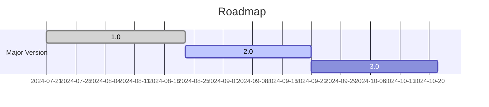

# Roadmap

???+ info

    It is intentional that I use docs to keep track of roadmap instead of using GitHub Projects.

## 1.0 (done)

Tasks:

- SCI Core code done;
- SCI-CLI 1st version done;

## 2.0 (active)

Tasks:

- SCI-Desktop: build a GUI program, with advanced features than SCI-CLI.

## 3.0 (todo)

Tasks:

- improve SCI-CLI:
  - convert from interactive mode to using arguments only
  - add features that SCI-Desktop exclusively has

## Others

Tasks:
- i18n: Only when SCI has a large user base will I consider this. The main question is: if a translation is a language I can't speak, how can I merge that PR? -- I don't even know whether the translation is appropriate.