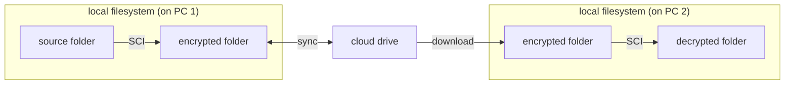

# :material-lightbulb-on: Concepts

It's better to know some basic concepts before using SCI.

## Folders

The workflow of SCI:

???+ note

    PC 1 and PC 2 are generally two different computers though they can be the same one (if you want to check whether SCI works correctly).

There are 4 folders in SCI.

| Folder                  | Description                                                                                                                                                                                                                                                                                                                                                             |
|-------------------------|-------------------------------------------------------------------------------------------------------------------------------------------------------------------------------------------------------------------------------------------------------------------------------------------------------------------------------------------------------------------------|
| Source Folder           | The folder you want to encrypt. SCI **only reads** this folder.                                                                                                                                                                                                                                                                                                         |
| Encrypted Folder (PC 1) | The folder where the encrypted data is located. SCI **incrementally updates** this folder based on the Source Folder.                                                                                                                                                                                                                                                   |
| Encrypted Folder (PC 2) | This folder is just a copy of Encrypted Folder (PC 1) downloaded from the cloud drive. **Strictly speaking, this folder should not be counted as a necessary part in SCI.** Because in most cases, users will download some files instead of all the files in Encrypted Folder (PC 1). In such cases, this folder is just an ordinary download path of the cloud drive. |
| Decrypted Folder        | The destination folder where the encrypted data is decrypted. It should be **an empty folder** before decryption.                                                                                                                                                                                                                                                       |

## User Password

There is a base password for the encryption of the source folder. It can be a simple `hello` or you birthday, while SCI will make the actual password strong enough.

## Password Level

There are two types of password level:

| Option 1 | Option 2        |
|----------|-----------------|
| Per file | Whole directory |

### 1. Per file

Each file has its own password. The actual password is based on both the user password and the filename.

While this level is more secure, it adds to the difficulty of data recovery because of the extra filename.

### 2. Whole directory

Every file has the same password. The actual password is only based on the user password.

## Database

A database has the following attributes:

| Attribute        | Description                                                                                             |
|------------------|---------------------------------------------------------------------------------------------------------|
| Name             | ID of a database                                                                                        |
| source folder    | path to a source folder                                                                                 |
| encrypted folder | path to a encrypted folder                                                                              |
| user password    | see [User Password](#user-password)                                                                     |
| password level   | see [Password Level](#password-level)                                                                   |
| encrypt scheme   | tells SCI how the actual password is made.  This is randomly made when users create  a database |

In all, a database contains all the information SCI needs to deal with the encryption and decryption of a source folder.

## What SCI is not

- A tool that follows every modern cryptography rule. Choose [other tools](../architecture/encryptionMechanism.md/#existing-tools) that guarantee absolute data security if you prioritize it.
- A cloud drive client.
- A file-sync tool.

## What's more?

See [Detailed Encryption Mechanism](../architecture/encryptionMechanism.md/#existing-tools).

