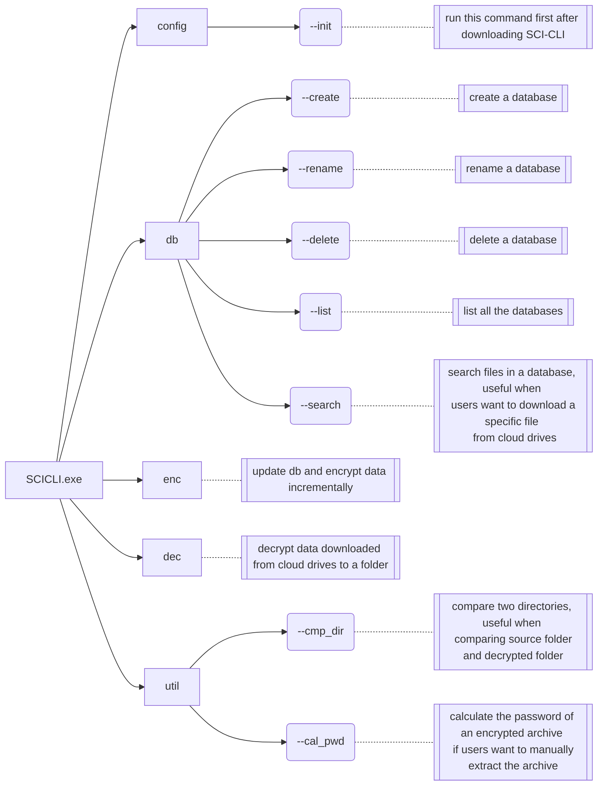

# :octicons-terminal-24: SCI-CLI

## Use cases

Dictionary-like documents won't make you know how to use SCI-CLI. So, it is better to list common use cases that contain those commands. Feel free to check the details of those commands in the [Commands overview](#commands-overview) section below.

### 1. Routinely backup data

TBD

### 2. Download data to another device

TBD

## Commands overview

SCI-CLI works in **interactive mode**. So, all the commands are listed below, nothing else.



E.g. If you want to list all the databases:

```
.\SCICLI.exe db --list
```


